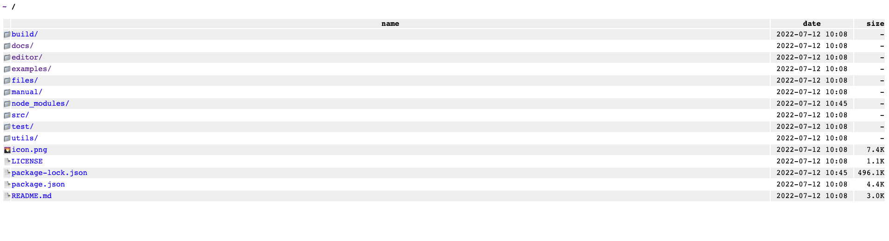
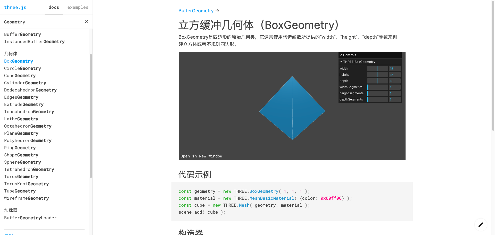
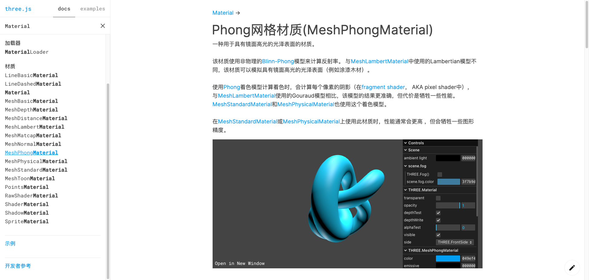

# 初学 threejs

>threejs 是一个易于使用 轻量 跨浏览器的通用前端 3d js 库目前已经使用 webgl 渲染器(基于opengl标准的js实现)实现
同时集成了 WebGPU（实验性） SVG CSS3D 渲染器
简而言之threejs就是一个在前端实现3d效果的库

不过说实话怎么看我都觉得threejs和 易于使用 轻量 这两个词没啥关系😄😄

## 安装
由于现在前端基本基于npm webpack（vite）模块化打包环境构建代码
```
npm install three -S
```

之后即可使用例如
```js
// 方式 1: 导入整个 three.js核心库
import * as THREE from 'three';
const scene = new THREE.Scene();
// 方式 2: 仅导入你所需要的部分
import { Scene } from 'three';
const scene = new Scene();

```

## 如何学习
> [threejs官网](https://threejs.org/) https://threejs.org/ 官网的文档是最新的且文档清楚有大部分中文翻译案例丰富
但是由于官网部署在国外且有的案例3d模型比较大在国内访问应该会比较慢
建议在github中 [threejs代码仓库](https://github.com/mrdoob/three.js)拉取代码

### 拉取代码之后 在本地安装运行
```
// 安装
npm install 
// 运行本地
npm start 
```
在命令行中即可看到threejs的运行地址默认为 http://localhost:8080



build    中是打包之后的代码
docs     文档
editor   一个由threejs编写的模型构建gui
examples 案例
直接查看文档即可学习threejs 如果英文不好选择中文


## 真正开始学习threejs

我们需要以下几个对象：场景、相机和渲染器，这样我们就能透过摄像机看到渲染出场景。
场景、相机、渲染器scene camera renderer

```html
<style>
  #container {
    width: 100%;
    height: 100%;
  }
</style>
<body>
  <div id="container"></div>
</body>
```
```js
import * as THREE from "three";
let container = document.getElementById("container");
let innerHeight = container.clientHeight;
let innerWidth = container.clientWidth;

// 1. 创建场景
const scene = new THREE.scene()

// 2.创建相机  PerspectiveCamera 透视相机 可以先不管就是个相机 参数先不管
const camera = new THREE.PerspectiveCamera(
  75,
  innerWidth / innerHeight,
  0.1,
  1000
);
// 设置相机位置 并加入场景scene中
camera.position.set(0, 0, 10);
scene.add(camera);

// 添加渲染器
const renderer = new THREE.WebGLRenderer()
// 设置渲染的尺寸大小
renderer.setSize(innerWidth, innerHeight);
// console.log(renderer);
// 将webgl渲染的canvas内容添加到container
container.appendChild(renderer.domElement);
// 使用渲染器，通过相机将场景渲染进来
renderer.render(scene, camera);

```
这时的页面因为没有物体和光源还是一篇漆黑
```js
    import * as THREE from "three";
    import { OrbitControls } from "three/examples/jsm/controls/OrbitControls";
    let container = document.getElementById("container");
    console.log(container);
    let innerHeight = container.clientHeight;
    let innerWidth = container.clientWidth;
    const scene = new THREE.Scene();
    const camera = new THREE.PerspectiveCamera(
      75,
      innerWidth / innerHeight,
      0.1,
      1000
    );
    camera.position.set(0, 0, 10);
    scene.add(camera);
    // 添加相机控制器
     const controls = new OrbitControls(camera, renderer.domElement);
    // 创建几何体
    const cubeGeometry = new THREE.BoxGeometry(1, 1, 1);
    // 创建材质
    const cubeMaterial = new THREE.MeshBasicMaterial({ color: 0xffff00 });
    // 根据几何体和材质创建物体
    const cube = new THREE.Mesh(cubeGeometry, cubeMaterial);
    // 将几何体添加到场景中
    scene.add(cube);
    const renderer = new THREE.WebGLRenderer();
    renderer.setSize(innerWidth, innerHeight);
    container.appendChild(renderer.domElement);
    function render() {
      controls.update();
      renderer.render(scene, camera);
      //   渲染下一帧的时候就会调用render函数
      requestAnimationFrame(render);
    }

    render();
```
这时页面中会出现一个小的立方体 并且通过 OrbitControls 可以移动相机查看立方体
在threejs中生成一个物体 需要至少两个东西 Geometry 和 Material

### Geometry
>Geometry 几何体 定义了物体长什么样子 threejs已经帮我们封装好了一些几何体可以直接使用



这些几何体都依赖了一个 BufferGeometry 
```js
const geometry = new THREE.BufferGeometry();
// 创建一个简单的矩形. 在这里我们左上和右下顶点被复制了两次。
// 因为在两个三角面片里，这两个顶点都需要被用到。
const vertices = new Float32Array( [
	-1.0, -1.0,  1.0,
	 1.0, -1.0,  1.0,
	 1.0,  1.0,  1.0,

	 1.0,  1.0,  1.0,
	-1.0,  1.0,  1.0,
	-1.0, -1.0,  1.0
] );

// itemSize = 3 因为每个顶点都是一个三元组。
geometry.setAttribute( 'position', new THREE.BufferAttribute( vertices, 3 ) );
const material = new THREE.MeshBasicMaterial( { color: 0xff0000 } );
const mesh = new THREE.Mesh( geometry, material );
```
在threejs中一个面由个顶点共同决定 而正方形是有两个三角形组合而成

### Material 
>Material 材质定义了物体的一些属性 比如反光 金属度 粗糙度 是否产生阴影 等等 
在threejs中要模拟 石头表面粗糙 不反光 就可以用 MeshLambertMaterial 这种材质
而当要模拟光滑反光的物体就可以使用MeshPhongMaterial
不同的材质功能不同 功能越多消耗的性能越多
模拟物体比较常用的是 MeshStandardMaterial 标准材质基于物理的渲染（PBR）最近已成为许多3D应用程序的标准，例如Unity， Unreal和 3D Studio Max。在实践中，该材质提供了比MeshLambertMaterial 或MeshPhongMaterial 更精确和逼真的结果，代价是计算成本更高。
还有一种更逼真的材质 MeshPhysicalMaterial这种材质是MeshStandardMaterial的扩展，提供了更高级的基于物理的渲染当然也更加耗费性能

**还需要注意一点为了性能考虑材质的很多属性是默认关闭的，需要手动开启，每开启一项功能在开启的时候才会更耗性能。也就是说你需要线开启这个功能，再设置这个属性**

比如说你想设置透明度
```js
// 需要先设置 transparent: true 再设置 opacity: 0.5或者0.4 0.3 或者其他值
const material = new THREE.MeshBasicMaterial({
  transparent: true,
  opacity: 0.5,
});
```


最后还有 dat.gui 视图控件 和 gsap 动画库 以及设置物体的旋转位移缩放等等

```js
import * as THREE from "three";
import { OrbitControls } from "three/examples/jsm/controls/OrbitControls";
// 导入动画库
import gsap from "gsap";
// 导入dat.gui
import * as dat from "dat.gui";
let container = document.getElementById("container");
let innerHeight = container.clientHeight;
let innerWidth = container.clientWidth;

const scene = new THREE.Scene();
const camera = new THREE.PerspectiveCamera(
  75,
  innerWidth / innerHeight,
  0.1,
  1000
);
camera.position.set(0, 0, 10);
scene.add(camera);
const cubeGeometry = new THREE.BoxGeometry(1, 1, 1);
const cubeMaterial = new THREE.MeshBasicMaterial({});
const cube = new THREE.Mesh(cubeGeometry, cubeMaterial);
// 圆形几何体
const geometry = new THREE.SphereGeometry(2, 32, 16);
const material = new THREE.MeshBasicMaterial({
  // transparent: true,
  wireframe: true, // 将几何图形渲染为线框
  // opacity: 0,
});
const sphere = new THREE.Mesh(geometry, material);
sphere.position.set(5, 0, 0);
scene.add(sphere);
// 修改物体的位置
// cube.position.set(5, 0, 0);
// cube.position.x = 3;
// 缩放
// cube.scale.set(3, 2, 1);
cube.scale.x = 5;
// 旋转
// cube.rotation.set(Math.PI / 4, 0, 0, "XZY");

console.log(cube);
// 将几何体添加到场景中
scene.add(cube);
const gui = new dat.GUI();
this.setState({
  gui,
});
gui
  .add(cube.position, "x")
  .min(0)
  .max(5)
  .step(0.01)
  .name("移动x轴")
  .onChange((value) => {
    console.log("值被修改：", value);
  })
  .onFinishChange((value) => {
    console.log("完全停下来:", value);
  });
//   修改物体的颜色
const params = {
  color: "#ffff00",
  fn: () => {
    //   让立方体运动起来
    gsap.to(cube.position, { x: 5, duration: 2, yoyo: true, repeat: -1 });
  },
};
gui.addColor(params, "color").onChange((value) => {
  console.log("值被修改：", value);
  cube.material.color.set(value);
});
// 设置选项框
gui.add(cube, "visible").name("是否显示");

var folder = gui.addFolder("设置立方体");
folder.add(cube.material, "wireframe");
// 设置按钮点击触发某个事件
folder.add(params, "fn").name("立方体运动");

// 初始化渲染器
const renderer = new THREE.WebGLRenderer();
renderer.setSize(innerWidth, innerHeight);
container.appendChild(renderer.domElement);
const controls = new OrbitControls(camera, renderer.domElement);
// 设置控制器阻尼，让控制器更有真实效果,必须在动画循环里调用.update()。
controls.enableDamping = true;

// 添加坐标轴辅助器
const axesHelper = new THREE.AxesHelper(5);
scene.add(axesHelper);

window.addEventListener("dblclick", () => {
  const fullScreenElement = document.fullscreenElement;
  if (!fullScreenElement) {
    // 双击控制屏幕进入全屏，退出全屏
    // 让画布对象全屏
    renderer.domElement.requestFullscreen();
  } else {
    //   退出全屏，使用document对象
    document.exitFullscreen();
  }
});

function render() {
  controls.update();
  renderer.render(scene, camera);
  //   渲染下一帧的时候就会调用render函数
  requestAnimationFrame(render);
}

render();

// 监听画面变化，更新渲染画面
window.addEventListener("resize", () => {
  //   console.log("画面变化了");
  // 更新摄像头
  camera.aspect = innerWidth / innerHeight;
  //   更新摄像机的投影矩阵
  camera.updateProjectionMatrix();
  //   更新渲染器
  renderer.setSize(innerWidth, innerHeight);
  //   设置渲染器的像素比
  renderer.setPixelRatio(window.devicePixelRatio);
});
```