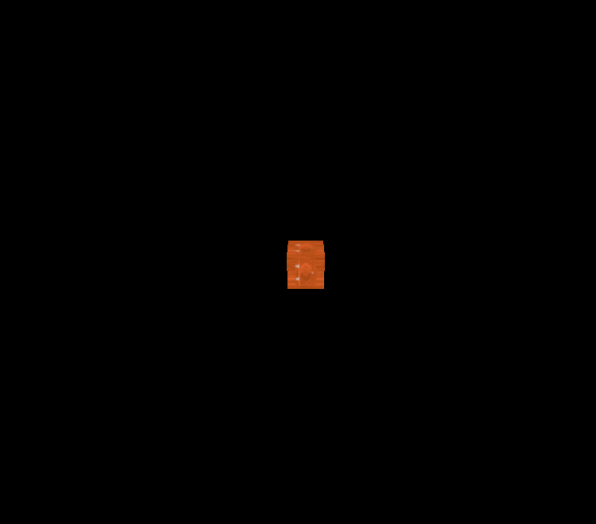

# 用一扇门进入threejs

```js
    let container = document.getElementById("container");
    console.log(container);
    let innerHeight = container.clientHeight;
    let innerWidth = container.clientWidth;

    const scene = new THREE.Scene();
    const camera = new THREE.PerspectiveCamera(
      75,
      innerWidth / innerHeight,
      0.1,
      1000
    );
    scene.add(camera);
    camera.position.set(0, 5, 10);
    const renderer = new THREE.WebGLRenderer();
    renderer.setSize(innerWidth, innerHeight);
    container.appendChild(renderer.domElement);
    const controls = new OrbitControls(camera, renderer.domElement);
    function renderer3D() {
      controls.update();
      renderer.render(scene, camera);
      requestAnimationFrame(renderer3D);
    }
    renderer3D();

    const cubeGeometry = new THREE.BoxBufferGeometry(1, 1, 1, 10);
    const material = new THREE.MeshBasicMaterial({
      // color: "#ff0000",
      // wireframe: true,
    });

    const mesh = new THREE.Mesh(cubeGeometry, material);
    scene.add(mesh);
    console.log(mesh);
```
还是之前的代码现在主要来了解材质 Material 与纹理 Texture

首先我们把纹理加载进来
```js
// 导入纹理 创建纹理加载器
const textureLoader = new THREE.TextureLoader();
// 加载纹理贴图
const doorColorTexture = textureLoader.load("./textures/door/color.jpg");
// 在添加纹理之前可以设置一些属性
// console.log(doorColorTexture);
// 设置纹理偏移
// doorColorTexture.offset.x = 0.5;
// doorColorTexture.offset.y = 0.5;
// doorColorTexture.offset.set(0.5, 0.5);
// 纹理旋转
// 设置旋转的原点
// doorColorTexture.center.set(0.5, 0.5);
// // 旋转45deg
// doorColorTexture.rotation = Math.PI / 4;
// 设置纹理的重复
// doorColorTexture.repeat.set(2, 3);
// // 设置纹理重复的模式
// doorColorTexture.wrapS = THREE.MirroredRepeatWrapping;
// doorColorTexture.wrapT = THREE.RepeatWrapping;

// 把加载的纹理放到材质中去
const basicMaterial = new THREE.MeshBasicMaterial({
  // color: "#ffff00",
  map: doorColorTexture,
});

```


这样盒子上就有贴图了