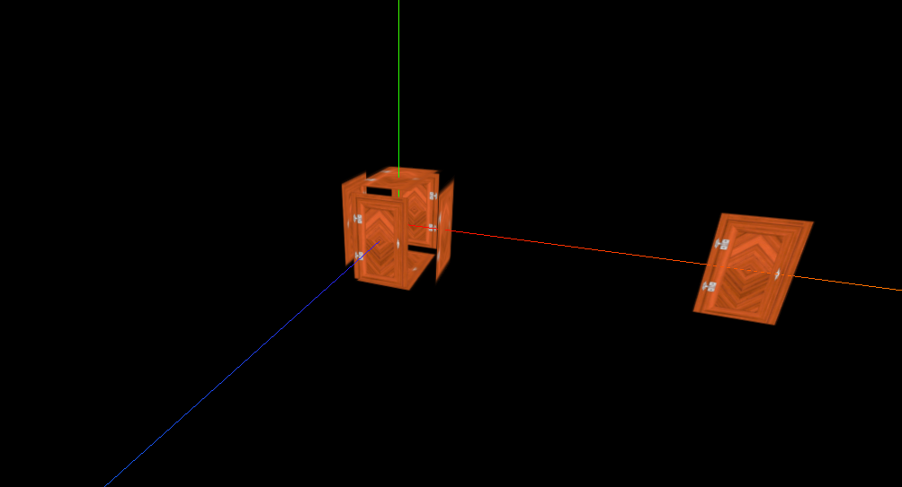

# 用一扇门进入threejs

```js
    let container = document.getElementById("container");
    console.log(container);
    let innerHeight = container.clientHeight;
    let innerWidth = container.clientWidth;

    const scene = new THREE.Scene();
    const camera = new THREE.PerspectiveCamera(
      75,
      innerWidth / innerHeight,
      0.1,
      1000
    );
    scene.add(camera);
    camera.position.set(0, 5, 10);
    const renderer = new THREE.WebGLRenderer();
    renderer.setSize(innerWidth, innerHeight);
    container.appendChild(renderer.domElement);
    const controls = new OrbitControls(camera, renderer.domElement);
    function renderer3D() {
      controls.update();
      renderer.render(scene, camera);
      requestAnimationFrame(renderer3D);
    }
    renderer3D();

    const cubeGeometry = new THREE.BoxBufferGeometry(1, 1, 1, 10);
    const material = new THREE.MeshBasicMaterial({
      // color: "#ff0000",
      // wireframe: true,
    });

    const mesh = new THREE.Mesh(cubeGeometry, material);
    scene.add(mesh);
    console.log(mesh);
```
还是之前的代码现在主要来了解材质 Material 与纹理 Texture

首先我们把纹理加载进来
```js
// 导入纹理 创建纹理加载器
const textureLoader = new THREE.TextureLoader();
// 加载纹理贴图
const doorColorTexture = textureLoader.load("./textures/door/color.jpg");
// 在添加纹理之前可以设置一些属性
// console.log(doorColorTexture);

// 设置纹理偏移
// doorColorTexture.offset.x = 0.5;
// doorColorTexture.offset.y = 0.5;
// doorColorTexture.offset.set(0.5, 0.5);


// 纹理旋转
// 设置旋转的原点
// doorColorTexture.center.set(0.5, 0.5);
// // 旋转45deg
// doorColorTexture.rotation = Math.PI / 4;


// 设置纹理的重复
// 横坐标两个纵坐标3三个
// doorColorTexture.repeat.set(2, 3); 需要配合 MirroredRepeatWrapping 或者 RepeatWrapping重复模式
// // 设置纹理重复的模式 THREE.MirroredRepeatWrapping是镜像重复
// doorColorTexture.wrapS = THREE.MirroredRepeatWrapping;
// RepeatWrapping 简单重复
// doorColorTexture.wrapT = THREE.RepeatWrapping;

// 把加载的纹理放到材质中去
const basicMaterial = new THREE.MeshBasicMaterial({
  // color: "#ffff00",
  map: doorColorTexture,
});

```


这样盒子上就有贴图了

```js
doorColorTexture.wrapS = THREE.MirroredRepeatWrapping;
doorColorTexture.wrapT = THREE.MirroredRepeatWrapping;
doorColorTexture.repeat.set(2, 3);
```


##### 纹理算法
http://localhost:8080/docs/index.html?q=texture#api/zh/textures/Texture

>magFilter 与 minFilter
.magFilter : number
当一个纹素覆盖大于一个像素时，贴图将如何采样。默认值为THREE.LinearFilter， 它将获取四个最接近的纹素，并在他们之间进行双线性插值。 另一个选项是THREE.NearestFilter，它将使用最接近的纹素的值。
.minFilter : number
当一个纹素覆盖小于一个像素时，贴图将如何采样。默认值为THREE.LinearMipmapLinearFilter， 它将使用mipmapping以及三次线性滤镜。


设置之后
```js
texture.magFilter = THREE.NearestFilter;
texture.minFilter = THREE.NearestFilter;
```

查看其他常量
http://localhost:8080/docs/index.html?q=texture#api/zh/constants/Textures

了解纹理算法 继续了解一下纹理的其他属性

##### 透明

```js
// 新增一个透明纹理贴图
const doorAlpheaTexture = textureLoader.load("./textures/door/alpha.jpg");
// 将透明纹理贴图添加到材质中注意设置 transparent: true,
const material = new THREE.MeshBasicMaterial({
  map: doorColorTexture,
  transparent: true,
  alphaMap: doorAlpheaTexture,
  opacity:1 
});

```
透明纹理贴图

这张图什么意思呢 外面黑色的部分就是透明 内部白色就是要显示，越黑透明度越高

渲染效果


##### 设置双面渲染  为了性能考虑默认只渲染了一面

.side : Integer
定义将要渲染哪一面 - 正面，背面或两者。 默认为THREE.FrontSide。其他选项有THREE.BackSide和THREE.DoubleSide。

这个相信自己旋转过的同学已经发现 后面是看不到的 通过side属性设置前面后面即可


##### 环境遮挡贴图
```js
const doorAoTexture = textureLoader.load(
  "./textures/door/ambientOcclusion.jpg"
);
const basicMaterial = new THREE.MeshBasicMaterial({
  map: doorColorTexture,
  transparent: true,
  alphaMap: doorAlpheaTexture,
  aoMap: doorAoTexture, //遮挡贴图
  aoMapIntensity: 0.5, // 设置暗度
});
const planeGeometry = new THREE.PlaneBufferGeometry(1, 1);
const plane = new THREE.Mesh(planeGeometry, basicMaterial);
plane.position.set(3, 0, 0);
scene.add(plane);
// 环境遮挡贴图需要设置第二组uv
planeGeometry.setAttribute(
  "uv2",
  new THREE.BufferAttribute(planeGeometry.attributes.uv.array, 2)
);

```


### 物理渲染
pbr
以前是模仿灯光的外观 现在是模仿光照的实际行为
更加真实

灯光属性  直接照明 间接照明 直接高光 间接高光 阴影 环境光闭塞
表面属性  基础色 法线 高光 粗糙度 金属度

入射光
  - 直接照明 直接从光源发射照相物体
  - 间接照明 环境光和直接光经过反射反弹二次进入的光

反射光
  - 镜面光 在经过表面反射聚焦在同一个方向进入人眼的高亮光
  - 漫反射 光被散射并沿着各个方向离开表面

光与表面的作用
直接漫反射  源头发射过来 四散出去的的直接高光 太阳照在比较粗糙的地方
直接高光    源头发射过来 集中反射出去
间接漫反射  环境光过来  表面散射
间接高光    环境光过来 集中反射出去

表面属性
基础色
法线 凹凸不平的反射
镜面

粗糙度
  表面在微观尺度上的粗糙度
  白色是粗糙的
  黑色是光滑的
  控制反射的“焦点”
  平滑=强烈的反射
  粗糙=模糊的，漫反射
金属度
具体地址看这里 https://zhuanlan.zhihu.com/p/342484575

要使用光照影响就得使用 MeshStandardMaterial 标准网格材质
```js
const basicMaterial = new THREE.MeshStandardMaterial({
  map: doorColorTexture,
  transparent: true,
  alphaMap: doorAlpheaTexture,
  aoMap: doorAoTexture,
  aoMapIntensity: 0.5,
  side: THREE.DoubleSide, // 为了更好的效果开启双面
});
```
将材质之后直接黑了？因为没有光源，神说要有光
MeshStandardMaterial是会对光作出反应，那么你没有光他自然是看不到的
```js
// 只添加环境光 从四面八方照射
const light = new THREE.AmbientLight(0xffffff,1);
// color - (参数可选）颜色的rgb数值。缺省值为 0xffffff。
// intensity - (参数可选)光照的强度。缺省值为 1。
scene.add(light);
```



```js
// 只添加平行光 从一个面照射
const dirLight = new THREE.DirectionalLight(0xffffff, 1);
dirLight.position.set(0, 10, 10);
scene.add(dirLight);
```
可以看到两边的面和后面的面都黑了


两种光都添加


##### 高度贴图
我们的门要有高度，不应该是一张平整的图

黑色就是平面不突出 灰色到白色就是突出 越白突出的越多

```js
const heightTexture = textureLoader.load("./textures/door/height.jpg");
const basicMaterial = new THREE.MeshStandardMaterial({
  map: doorColorTexture,
  transparent: true,
  alphaMap: doorAlpheaTexture,
  aoMap: doorAoTexture,
  aoMapIntensity: 0.5,
  side: THREE.DoubleSide,
  displacementMap: heightTexture,
});
// 加入贴图之后并没有效果 因为没有顶点 在之前的篇章中说过几何体可以设置顶点数量 当然越多越消耗性能
/*
.displacementMap : Texture
位移贴图会影响网格顶点的位置，与仅影响材质的光照和阴影的其他贴图不同，移位的顶点可以投射阴影，阻挡其他对象， 以及充当真实的几何体。位移纹理是指：网格的所有顶点被映射为图像中每个像素的值（白色是最高的），并且被重定位。
.displacementScale : Float
位移贴图对网格的影响程度（黑色是无位移，白色是最大位移）。如果没有设置位移贴图，则不会应用此值。默认值为1。
*/
```
```js
// 为其添加顶点
const cubeGeometry = new THREE.BoxBufferGeometry(1, 1, 1, 100, 100, 100);
```


。。。效果非常明显
那么还需要设置一个值 displacementScale 设置成0.1就不会这么突出

##### 粗糙度

.roughness : Float
材质的粗糙程度。0.0表示平滑的镜面反射，1.0表示完全漫反射。默认值为1.0。如果还提供roughnessMap，则两个值相乘。
.roughnessMap : Texture
该纹理的绿色通道用于改变材质的粗糙度。

粗糙度 的图片也是一样的 黑色越光滑就是0 白色就是越粗糙 为1

粗糙度的图整个都是黑色就都反射了

##### 金属度

.metalness : Float
材质与金属的相似度。非金属材质，如木材或石材，使用0.0，金属使用1.0，通常没有中间值。 默认值为0.0。0.0到1.0之间的值可用于生锈金属的外观。如果还提供了metalnessMap，则两个值相乘。
.metalnessMap : Texture
该纹理的蓝色通道用于改变材质的金属度。
金属度贴图 越黑金属度越低  越白金属度越高


##### 法线
不同的凹缝应该要有不同的光照效果

法线贴图比较复杂不用的颜色对应不同的方向的向量

可以看到和图片对比 缝隙的光照效果反射都是不同的
