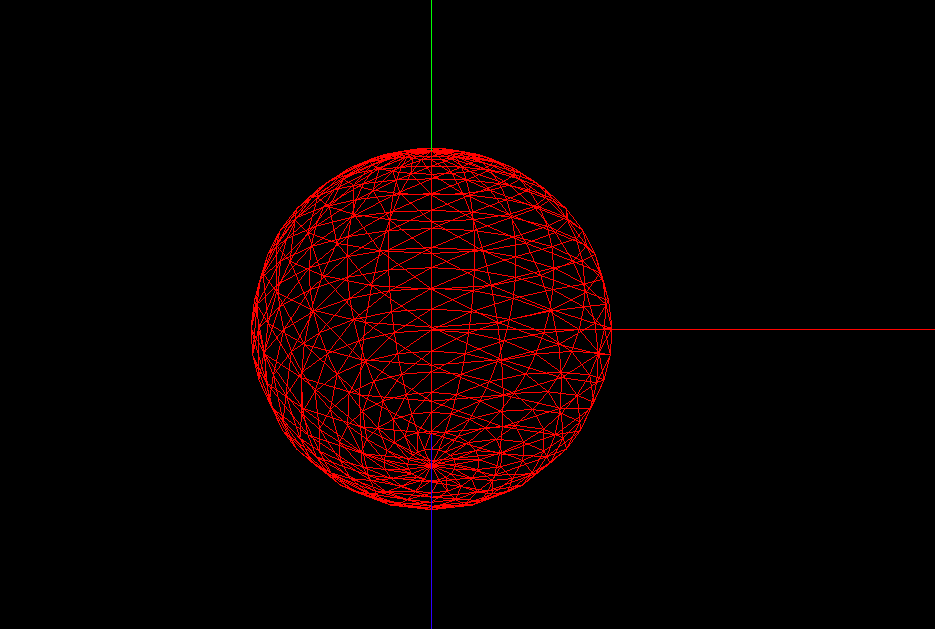
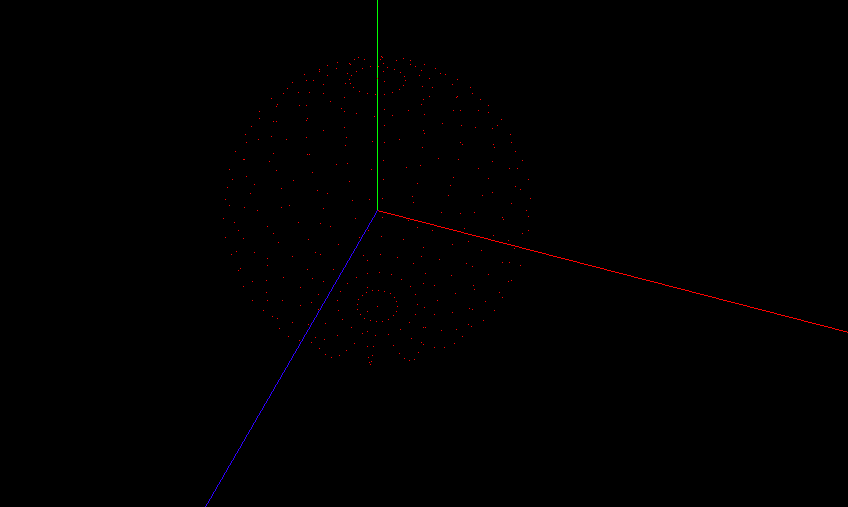
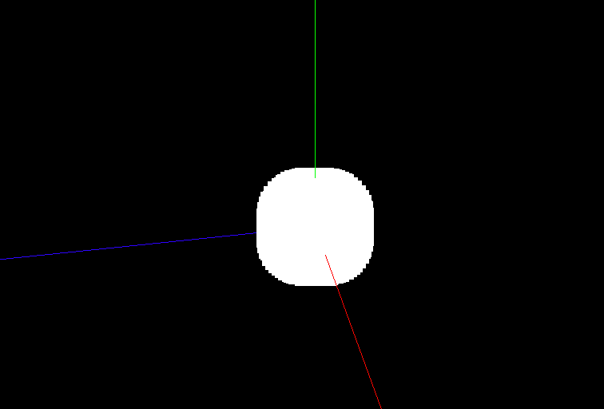
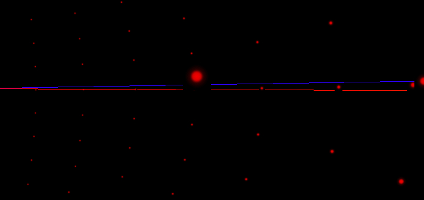
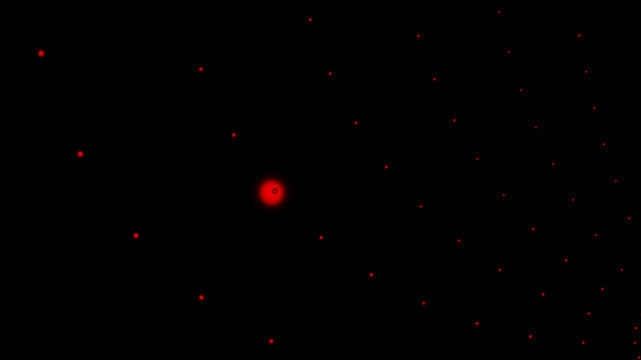

# 7.点材质

```js
    let container = document.getElementById("container");
    console.log(container);
    let innerHeight = container.clientHeight;
    let innerWidth = container.clientWidth;

    const scene = new THREE.Scene();
    const camera = new THREE.PerspectiveCamera(
      75,
      innerWidth / innerHeight,
      0.1,
      1000
    );

    scene.add(camera);
    camera.position.set(0, 5, 10);

    const axesHelper = new THREE.AxesHelper(100);
    scene.add(axesHelper);
    const renderer = new THREE.WebGLRenderer();
    renderer.setSize(innerWidth, innerHeight);
    // 渲染器开启阴影
    renderer.shadowMap.enabled = true;
    container.appendChild(renderer.domElement);
    const controls = new OrbitControls(camera, renderer.domElement);

    function renderer3D() {
      controls.update();
      renderer.render(scene, camera);
      requestAnimationFrame(renderer3D);
    }
    renderer3D();

    //创建球几何体
    const sphereGeometry = new THREE.SphereBufferGeometry(1, 20, 20);
    const material = new THREE.MeshBasicMaterial({
      color: "#ff0000",
      wireframe: true,
    });
    const sphere = new THREE.Mesh(sphereGeometry, material);
    sphere.castShadow = true;
    scene.add(sphere);

```

首先使用之前的代码创建一个球体 使用MeshBasicMaterial 并设置wireframe: true,让球体以网格的形状生成

之后修改代码将Mesh 改成 points
```js

    const sphereGeometry = new THREE.SphereBufferGeometry(1, 20, 20);
    const material = new THREE.MeshBasicMaterial({
      color: "#ff0000",
      wireframe: true,
    });
    const sphere = new THREE.Points(sphereGeometry, material);
    sphere.castShadow = true;
    scene.add(sphere);
```



第二张看不清可以放大点看

再修改Material材质 变成 PointsMaterial
```js
// 先不传入参数试试
const sphereGeometry = new THREE.SphereBufferGeometry(1, 20, 20);
const PointMaterial = new THREE.PointsMaterial({
  // color: "#ff0000",
  // wireframe: true,
});
// PointMaterial.size = 0.01 之后再开启这行代码
const sphere = new THREE.Points(sphereGeometry, PointMaterial);
sphere.castShadow = true;
scene.add(sphere);
```


这是个什么鬼东西？

其实是一个个正方形叠加在一起 我上面设置的 SphereBufferGeometry 半径才1
而 PointMaterial 默认的size就是0.01所以会这样

那么添加 PointMaterial.size = 0.01 就正常了 这样看清之后每个粒子都是一个正方形


设置点材质的其他属性

.color : Color
材质的颜色(Color)，默认值为白色 (0xffffff)。
.sizeAttenuation : Boolean
指定点的大小是否因相机深度而衰减。（仅限透视摄像头。）默认为true。
粒子离我们越近越大 设置false 就是无视距离都一样大
一般都是true

为points添加纹理
```js
const textureLoader = new THREE.TextureLoader();
const pointTexture = textureLoader.load("./textures/particles/1.png");
//创建球几何体
const sphereGeometry = new THREE.SphereBufferGeometry(2, 20, 20);
const pointMaterial = new THREE.PointsMaterial({
  color: "#ff0000",
  map: pointTexture,
});
pointMaterial.size = 0.05;
// pointMaterial.map = pointTexture;
// pointMaterial.sizeAttenuation = false;
const points = new THREE.Points(sphereGeometry, pointMaterial);
scene.add(points);
```
这样粒子就不是单调的正方形了 而是图片的样式
但是点有个问题是 图片的黑边会挡住辅助线 当然也会挡住一些其他的东西 


所以需要设置透明 透明纹理，和之前门的纹理原理一样黑色的部分是透明的

```js
const pointMaterial = new THREE.PointsMaterial({
  color: "#ff0000",
  map: pointTexture,
  transparent: true,
  alphaMap: pointTexture,
});
```
这好我这张图边上就是黑的所以可以直接拿来用 😄 😄 😄 

但是后面的点却还是被挡住了 因为是相机认为他看到了一个物体，而在其后面的物体就不用显示了

需要设置Material depthWrite 为false 这个属性是继承自 Material
.depthWrite : Boolean
渲染此材质是否对深度缓冲区有任何影响。默认为true。

但是却又有一个奇怪的问题 后面的居然会有小黑边


```js
const pointMaterial = new THREE.PointsMaterial({
  color: "#ff0000",
  map: pointTexture,
  transparent: true,
  alphaMap: pointTexture,
  depthWrite: false,
  blending: THREE.AdditiveBlending, // 设置这个
});

```
.blending : Blending
在使用此材质显示对象时要使用何种混合。 默认是 THREE.NormalBlending 
在颜色相同时 用什么混合模式混合

http://localhost:8080/docs/index.html#api/zh/constants/Materials
混合类型
THREE.NoBlending
THREE.NormalBlending
THREE.AdditiveBlending 相加混合
THREE.SubtractiveBlending
THREE.MultiplyBlending 相乘混合
THREE.CustomBlending

这种情况可以使用混合 AdditiveBlending MultiplyBlending

### 星空案例一

```js
    let container = document.getElementById("container");
    console.log(container);
    let innerHeight = container.clientHeight;
    let innerWidth = container.clientWidth;

    const scene = new THREE.Scene();
    const camera = new THREE.PerspectiveCamera(
      75,
      innerWidth / innerHeight,
      0.1,
      1000
    );

    scene.add(camera);
    camera.position.set(0, 5, 5);

    const axesHelper = new THREE.AxesHelper(100);
    scene.add(axesHelper);
    const renderer = new THREE.WebGLRenderer();
    renderer.setSize(innerWidth, innerHeight);
    // 渲染器开启阴影
    renderer.shadowMap.enabled = true;
    container.appendChild(renderer.domElement);
    const controls = new OrbitControls(camera, renderer.domElement);


    const textureLoader = new THREE.TextureLoader();
    const pointTexture = textureLoader.load("./textures/particles/1.png");
    //创建球几何体

    const geometry = new THREE.BufferGeometry();
    const num = 5004;
    const floatArray = new Float32Array(num);
    const colorArray = new Float32Array(num);
    for (let index = 0; index < num; index++) {
      floatArray[index] = Math.random() * 100 - 50;
      colorArray[index] = Math.random();
    }
    geometry.setAttribute("position", new THREE.BufferAttribute(floatArray, 3));
    //  光设置 color还不够需要设置 vertexColors  启用顶点颜色设置
    geometry.setAttribute("color", new THREE.BufferAttribute(colorArray, 3));

    const pointMaterial = new THREE.PointsMaterial({
      // color: "#ff0000",
      map: pointTexture,
      transparent: true,
      alphaMap: pointTexture,
      depthWrite: false,
      blending: THREE.AdditiveBlending,
      // 启用顶点颜色设置
      vertexColors: true,
    });
    pointMaterial.vertexColors = true;
    pointMaterial.size = 1;
    const points = new THREE.Points(geometry, pointMaterial);
    scene.add(points);


    function renderer3D() {
      // 
      // points.rotation.x = Date.now()
      controls.update();
      renderer.render(scene, camera);
      requestAnimationFrame(renderer3D);
    }
    renderer3D();
```


